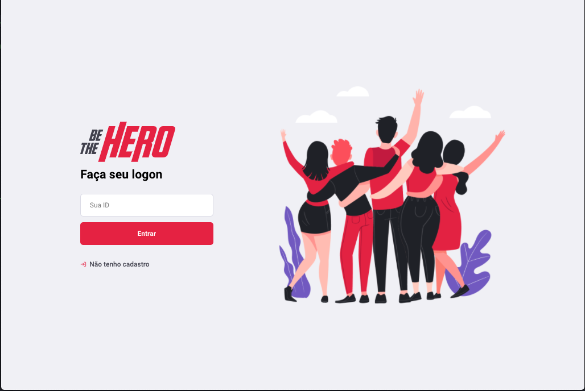
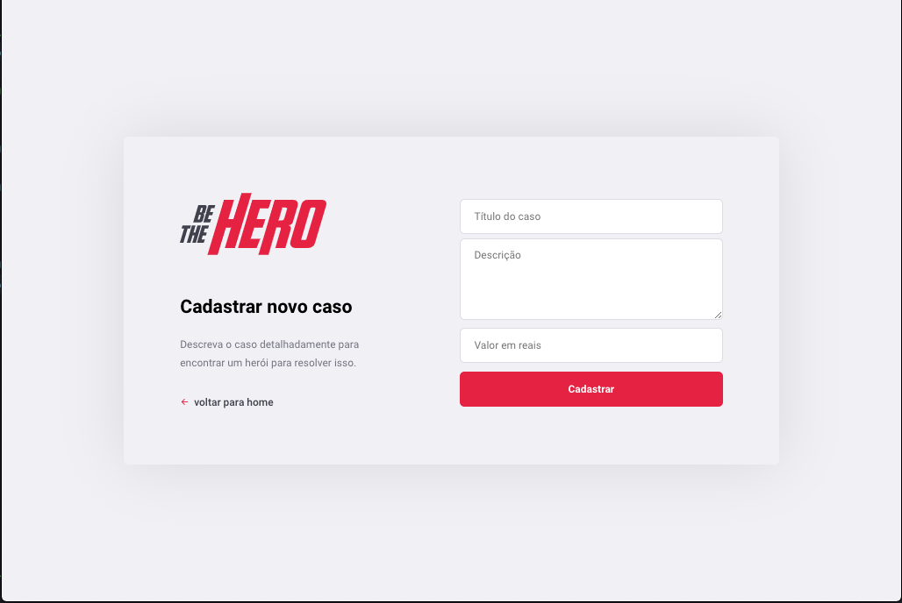
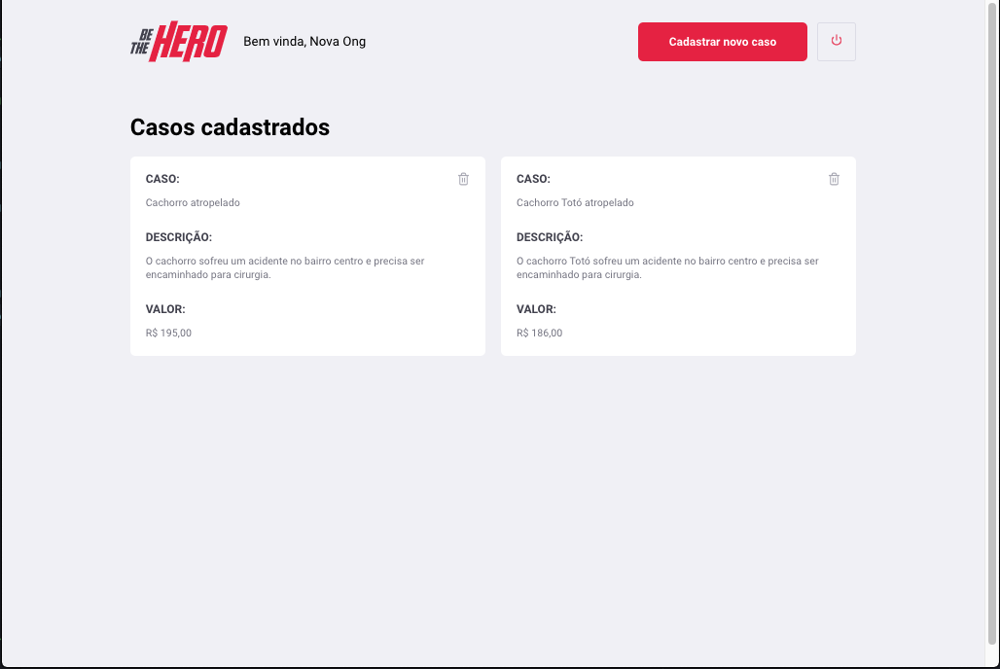

<h1 align="center">
  
</h1>

<h4 align="center">
 🚀 Semana OmniStack 11.0
</h4>

  

  
  
  

  

  

  <a href="#rocket-tecnologias">Tecnologias</a>&nbsp;&nbsp;&nbsp;|&nbsp;&nbsp;&nbsp;
  <a href="#funcionalidades">Funcionalidades</a>&nbsp;&nbsp;&nbsp;|&nbsp;&nbsp;&nbsp;
  <a href="#telas-da-aplicacao">Telas da aplicação</a>&nbsp;&nbsp;&nbsp;|&nbsp;&nbsp;&nbsp;
  <a href="#memo-license">License</a>

Aplicação Web BE THE HERO para cadastro de Ongs e seus casos, consumindo a API REST (back-end). 

[Aplicação Back-end https://github.com/remulocosta/backend-OmniStack11](https://github.com/remulocosta/backend-OmniStack11)

## :rocket: Tecnologias

Este projeto usa estas tecnologias:

- [React](https://reactjs.org)
- [axios](https://github.com/axios/axios)
- [React](https://reactjs.org)
- [React](https://reactjs.org)

## Funcionalidades

- Login de ONG
- Logout de ONG
- Cadastro de ONG
- Cadastrar novos casos
- Deletar casos
- Listar casos específicos de uma ONG
- Listar todos os casos
- Entrar em contato com a ONG

## Telas da aplicação

Página de login | Cadastro Ongs 
--------- | ---------
 | 

Cadastro de casos | Lista de casos da Ong 
--------- | ---------
 | 

--

This project was bootstrapped with [Create React App](https://github.com/facebook/create-react-app).

## Available Scripts

In the project directory, you can run:

### `yarn start` or `npm start`

Runs the app in the development mode. 
Open [http://localhost:3000](http://localhost:3000) to view it in the browser.

The page will reload if you make edits. 
You will also see any lint errors in the console.

## Learn More

You can learn more in the [Create React App documentation](https://facebook.github.io/create-react-app/docs/getting-started).

To learn React, check out the [React documentation](https://reactjs.org/).

### Advanced Configuration

This section has moved here: https://facebook.github.io/create-react-app/docs/advanced-configuration

### Deployment

This section has moved here: https://facebook.github.io/create-react-app/docs/deployment

### `yarn build` fails to minify

This section has moved here: https://facebook.github.io/create-react-app/docs/troubleshooting#npm-run-build-fails-to-minify

## :memo: License

This project uses the MIT license. Read [LICENSE](LICENSE.md) for details.

---

Made with ♥ by Remulo Costa :wave:
